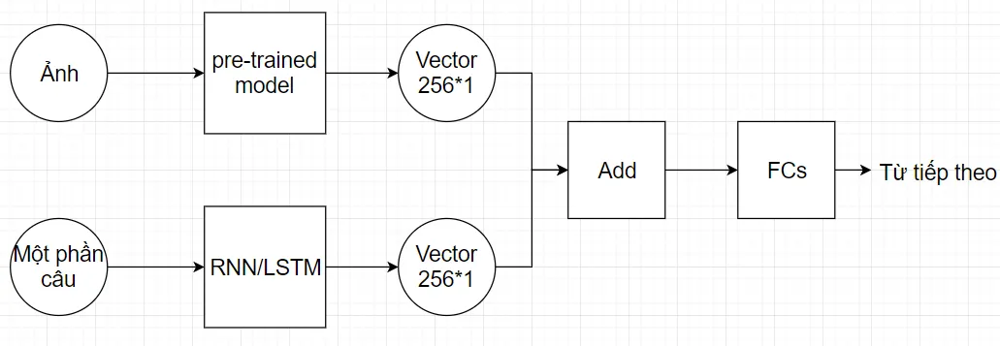
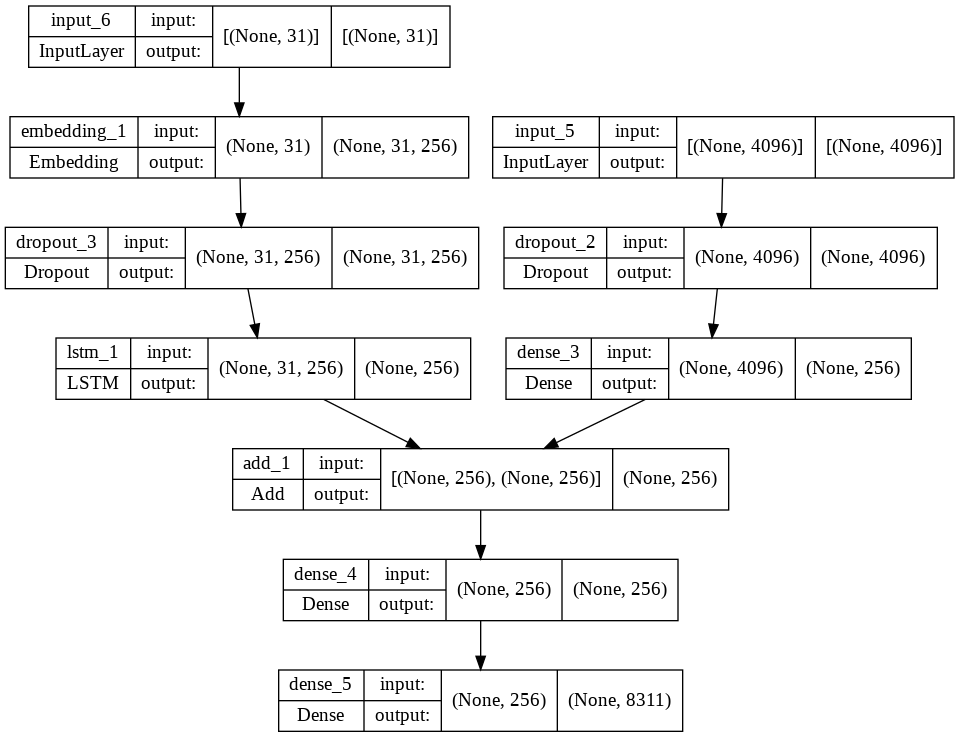

# Image Captioning Project 

## Dataset 
* Flickr 8k Dataset URL: https://www.kaggle.com/datasets/adityajn105/flickr8k

## Trained Model Example: 
* tensor model: https://bom.so/ADYKpa
* torch model:  

## Model Architecture
* Follow Ideal Model: 

* Detail Designed Model Architecture:
